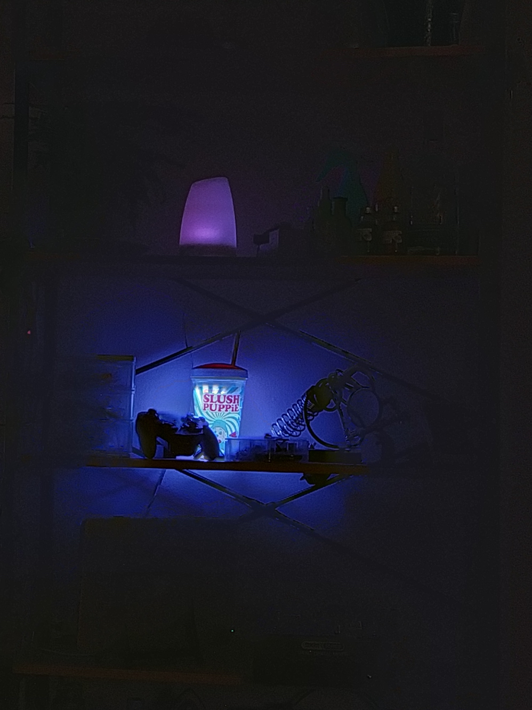

# pixelJar

An RGB colour changing lamp, built using an ESP8266 MCU and programmed with Micropython. 

The project was initially housed in a glass jar and used NeoPixel LEDs (hence pixelJar); however, the final implementation was hosued inside a plastic Slush Puppy branded cup.

The lamp features apush button in the top of the straw which can be used to cycle through light modes, or held down to go into sleep.

**Please note:** this project was completed while I was still an undergraduate in computer science and was my first attempt at programming an MCU. So please do not assume this is a display of all my skill. Just something fun. More projects to be uploaded soon. 

